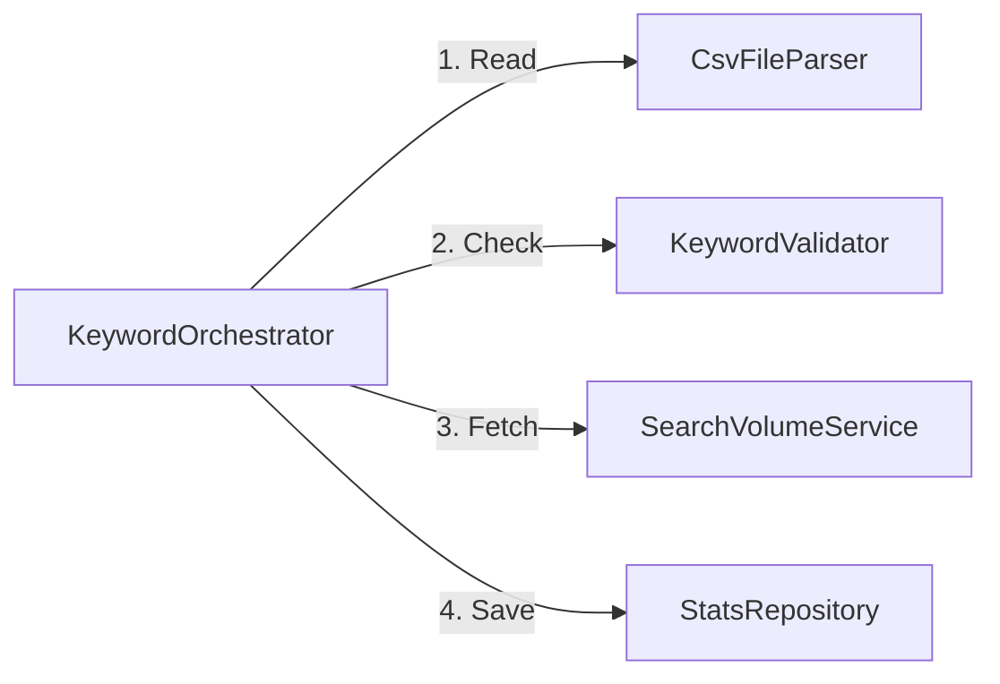

# Single Responsibility Principle (SRP)
> "A class should have one, and only one, reason to change." — Robert C. Martin

## 🏢 The Scenario: SEO Keyword Processor
Imagine we are building a backend service for an SEO tool. The requirement is simple:
1.  **Read** a list of keywords from a CSV file.
2.  **Validate** them (remove empty or banned words).
3.  **Fetch** their search volume from an external API (e.g., Google Trends).
4.  **Save** the results to our analytics database.

---

## ❌ The "Bad" Approach: The God Class
In the naive implementation, we create a single class called `KeywordProcessor`. It handles everything.

### Why is this bad?
This class violates SRP because it has **multiple reasons to change**:
1.  **File Format Change:** If we switch from CSV to JSON, we must modify this class.
2.  **Business Logic Change:** If we want to filter out keywords shorter than 3 characters, we modify this class.
3.  **API Change:** If the external API authentication changes, we modify this class.
4.  **Database Change:** If we switch from SQL to MongoDB, we modify this class.

This high coupling means a change in the *Database* logic could accidentally break the *Parsing* logic. Testing is also a nightmare—you can't test the validation logic without mocking the entire file system and database.

---

## ✅ The "Good" Approach: Separation of Concerns
To fix this, we break the "God Class" into four distinct specialists. Each class does **one thing well**.

### 1. The Specialists
| Class | Responsibility | Reason to Change |
|-------|---------------|------------------|
| `CsvFileParser` | Reads raw text from files. | File format changes (CSV → JSON). |
| `KeywordValidator` | Decides if a keyword is valid. | Business rules change (e.g., ban "adult" words). |
| `SearchVolumeService` | Talks to the external API. | API endpoint or auth changes. |
| `StatsRepository` | Saves data to storage. | Database technology changes (SQL → Mongo). |

### 2. The Orchestrator
We still need something to tie it all together. We introduce a `KeywordOrchestrator`.
*   **It does not know** how to parse a file.
*   **It does not know** how to talk to the DB.
*   **It only knows** the *workflow*: "Get data, validate it, enrich it, save it."

### 3. The Architecture

---

## 🏆 Key Benefits
1.  **Testability:** You can write unit tests for `KeywordValidator` without needing a real database or API connection.
2.  **Reusability:** The `CsvFileParser` can be reused in other parts of the app that need to read CSVs.
3.  **Maintainability:** If the API breaks, you know exactly where to look (`SearchVolumeService`). You don't have to scroll through SQL queries to find the HTTP request code.

## 💻 Implementations
Check out the code to see the difference!

- [**TypeScript**](./typescript)
