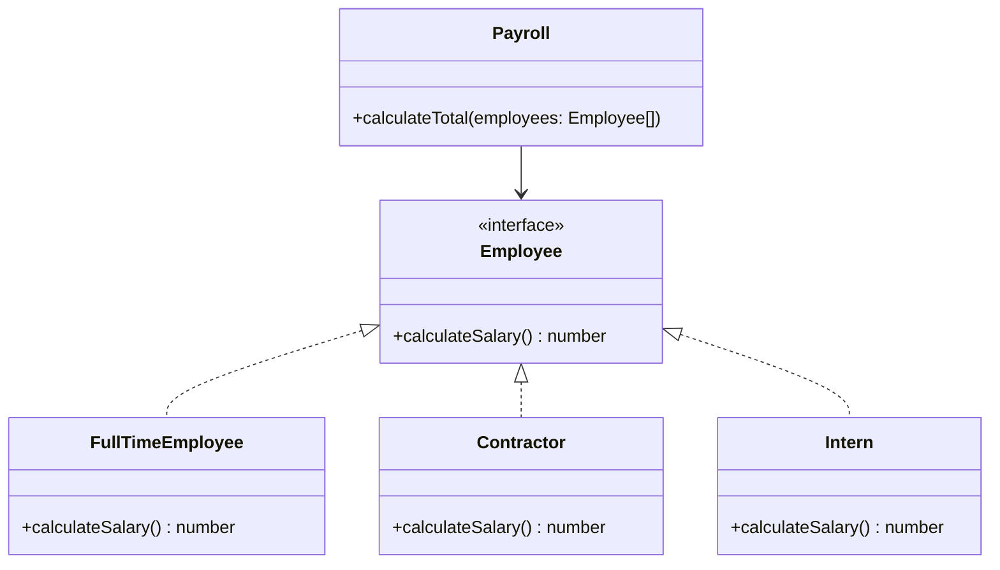

# Open/Closed Principle (OCP)

> "Software entities (classes, modules, functions, etc.) should be open for extension, but closed for modification." — Bertrand Meyer

## 🏢 The Scenario: Payroll System

We are building a payroll system for a company. Initially, we only have **Full-Time Employees** who are paid by the hour.
Later, the company hires **Contractors** (fixed rate) and **Interns** (hourly but with a different calculation).

The requirement is to calculate the salary for a list of employees.

---

## ❌ The "Bad" Approach: Modification

In the naive implementation, we have a `SalaryCalculator` class that checks the "type" of the employee and runs different logic using good old `if-elseif-else` conditions.

### Why is this bad?

Every time we add a new employee type (e.g., "Freelancer" or "Part-Time"), we have to **modify** the `SalaryCalculator` class.

1. **Risk of Bugs:** Changing existing code (the `if/else` or `switch` block) might break the logic for existing employee types.
2. **Violation of OCP:** The class is not closed for modification.

---

## ✅ The "Good" Approach: Extension

To fix this, we use **Polymorphism**. We define a common contract (Interface or Abstract Class) called `Employee`.
Each specific employee type (`FullTime`, `Contractor`, `Intern`) implements its own salary logic.

The `SalaryCalculator` class now just calls `calculateSalary()` on the interface. It doesn't care what specific type the employee is.

### The Architecture

### Key Benefits

1. **Extensibility:** To add a new employee type, we just create a new class. We **do not touch** the existing `Payroll` code.
2. **Safety:** Existing logic remains untested and untouched, reducing regression bugs.

## 💻 Implementations

-  [**TypeScript**](./typescript)
