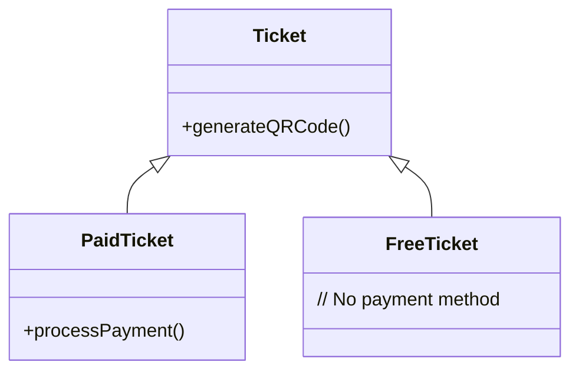

# Liskov Substitution Principle (LSP)

> "Subtypes must be substitutable for their base types." — Barbara Liskov

## 🏢 The Scenario: Event Ticketing System

We are building a ticketing platform for events. We handle:

1. **Paid Events** (Concerts, Movies) - Require payment processing.
2. **Free Events** (Community Meetups) - No payment needed.

The system needs to process a batch of ticket requests.

---

## ❌ The "Bad" Approach: Breaking the Contract

We create a base class `EventTicket` with a method `processPayment()`.
We then create a `FreeTicket` subclass. Since free tickets don't have a price, we throw an error in `processPayment()`.

### Why is this bad?

This violates LSP because **`FreeTicket` cannot be substituted for `EventTicket`**.
Any code that iterates through a list of `EventTicket`s and calls `processPayment()` will **crash** when it hits a free ticket. The client code now needs to know specific details about the subclass ("If type is free, don't call pay"), which breaks the abstraction.

---

## ✅ The "Good" Approach: Segregation

We restructure the hierarchy.

1. `EventTicket` (Base) - Handles common logic like "generate QR code".
2. `PaidTicket` (Subclass) - Adds `processPayment()`.
3. `FreeTicket` (Subclass) - Does _not_ have `processPayment()`.

The payment processor now only accepts `PaidTicket`s, ensuring type safety and preventing runtime errors.

### The Architecture

## 💻 Implementations

-  [**TypeScript**](./typescript)
