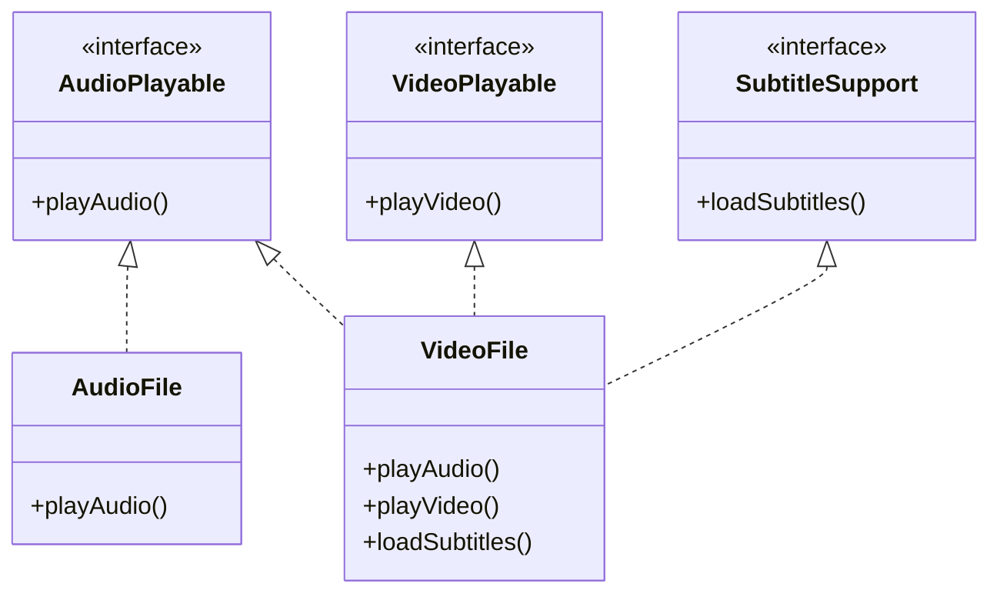

# Interface Segregation Principle (ISP)

> "Clients should not be forced to depend upon interfaces that they do not use." — Robert C. Martin

## 🏢 The Scenario: Universal Media Player

We are building a media player that handles various file formats.

1. **Audio Files** (`.mp3`, `.wav`) - Can be played.
2. **Video Files** (`.mp4`, `.mkv`) - Can be played and have visual output.
3. **Subtitled Videos** - Need to load and display text subtitles.

---

## ❌ The "Bad" Approach: Fat Interface

We define a single interface `MediaPlayer` that has _all_ possible media actions: `playAudio()`, `playVideo()`, and `loadSubtitles()`.

### Why is this bad?

This violates ISP because **Audio Files** are forced to implement methods they don't need.

-  `AudioFile` must implement `playVideo()` and `loadSubtitles()`, usually by throwing an error or doing nothing.
-  This pollutes the class and confuses the client ("Can I call `loadSubtitles` on this mp3? The compiler says yes, but it crashes at runtime").

---

## ✅ The "Good" Approach: Segregated Interfaces

We split the "Fat Interface" into smaller, specific ones.

1. `AudioPlayable` - For anything with sound.
2. `VideoPlayable` - For anything with visuals.
3. `SubtitleSupport` - For anything that needs text overlays.

Now, `AudioFile` only implements `AudioPlayable`. `VideoFile` implements all three.

### The Architecture

## 💻 Implementations

-  [**TypeScript**](./typescript)
