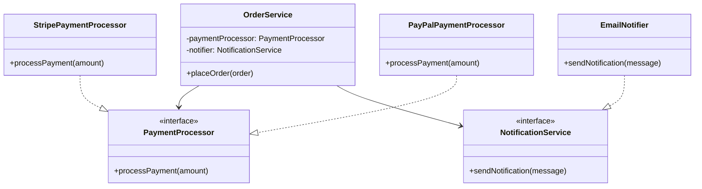

# Dependency Inversion Principle (DIP)

> "High-level modules should not depend on low-level modules. Both should depend on abstractions." — Robert C. Martin

## 🏢 The Scenario: Online Store Backend

We are building a backend for an online store that handles:

1. **Order Processing**: Validating and placing orders.
2. **Payment Processing**: Charging credit cards (e.g., via Stripe).
3. **Notifications**: Sending email confirmations to customers.

---

## ❌ The "Bad" Approach: Tightly Coupled Dependencies

The high-level `OrderService` directly instantiates and depends on low-level classes like `StripePaymentProcessor` and `EmailNotifier`.

### Why is this bad?

-  **Rigid**: If we want to switch from Stripe to PayPal, we have to modify the `OrderService` code.
-  **Hard to Test**: We can't easily mock the payment processor or email sender in unit tests; the service will try to send real emails and charge real cards.

---

## ✅ The "Good" Approach: Dependency Injection

We introduce interfaces (abstractions) for `PaymentProcessor` and `NotificationService`.
The `OrderService` depends on these interfaces, not the concrete classes. The concrete implementations are "injected" into the service at runtime.

### The Architecture

## Implementations

-  [TypeScript](./typescript)
